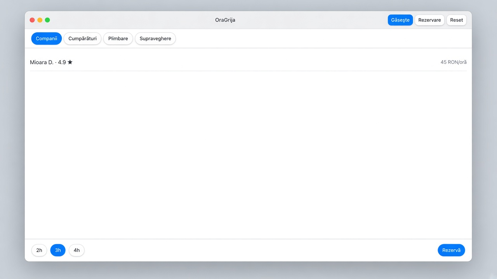
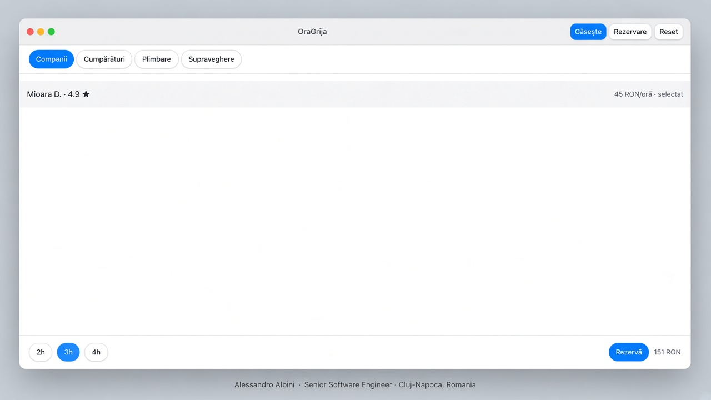
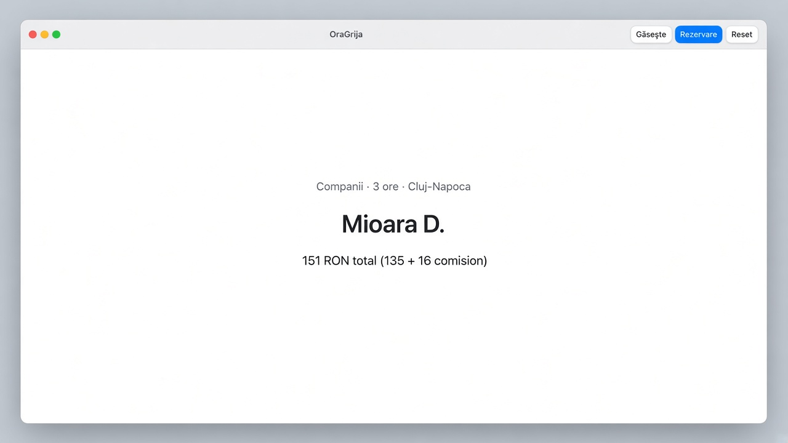
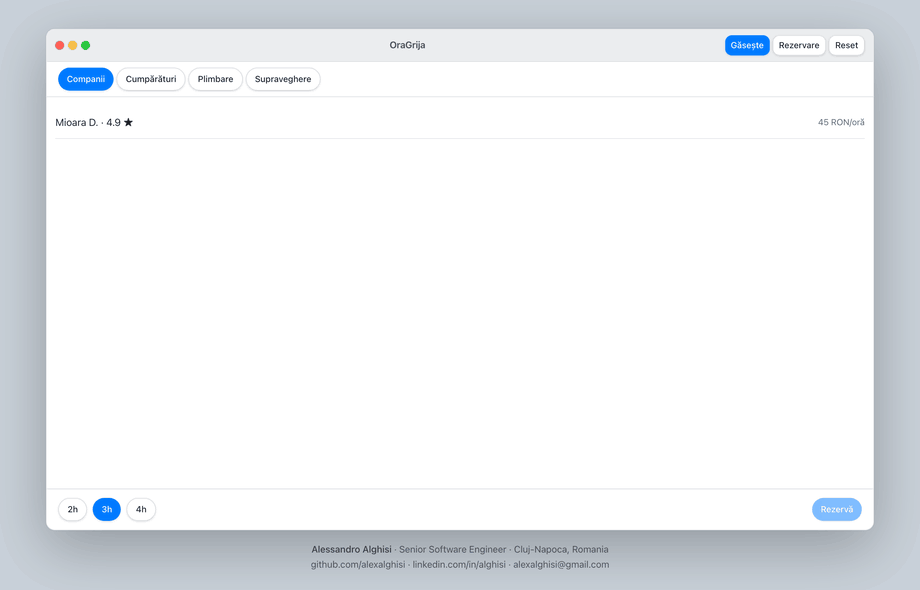
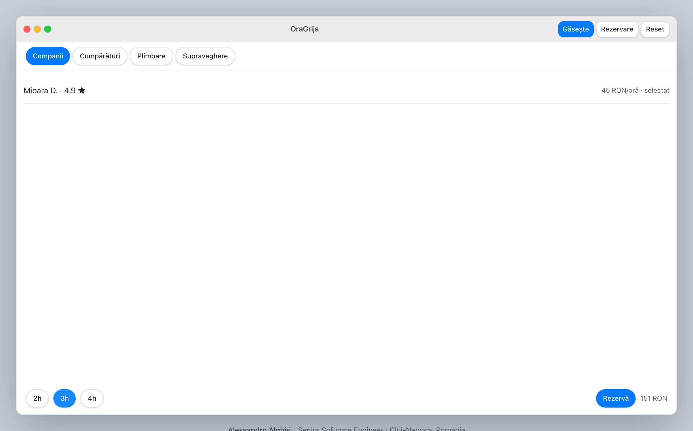
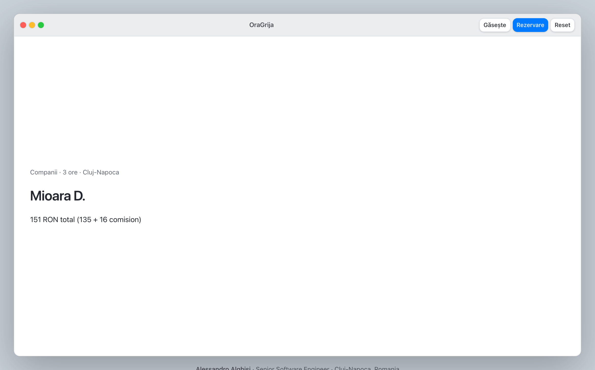
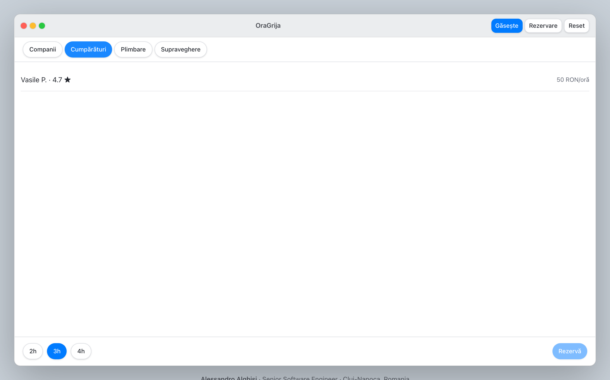

# OraGrija

Îngrijitori verificați, pe oră, pentru o persoană în vârstă. Familia rezervă
2–4 ore (companie, cumpărături, plimbare, supraveghere). Platforma ia 12% și
îi arată comisionul înainte să apese **Rezervă**.

**Live:** [alexalghisi.github.io/OraGrija](https://alexalghisi.github.io/OraGrija/)

După `npm install` și `npm run dev` vezi fereastra asta: filtru → îngrijitor → ore →
**Rezervă**.

<p align="center">
  
  
  
</p>

<p align="center">
  
</p>

Înregistrare din app, cu cursor: [`docs/cum-merge.gif`](docs/cum-merge.gif) ·
[`docs/oragrija.webm`](docs/oragrija.webm).

**React 19 · TypeScript (strict) · Vite 8 · Tailwind CSS 4 · Zustand · Vitest ·
Playwright**

---

## Cum arată o rezervare

Alegi serviciul, dai click pe un îngrijitor, setezi durata, confirmi. Totalul
apare pe loc — tarif × ore + comision.

1. **Găsește** — lista e deja filtrată pe oraș (Cluj-Napoca) și pe serviciu.
2. **Selectează** — Mioara D., 45 RON/oră, 4.9. Tura implicită e 3 ore.
3. **Rezervă** — 135 RON îngrijitor + 16 RON comision = **151 RON**.

<p align="center">
  
  
</p>

---

## Pentru familie

Casa de bătrâni e scumpă și are locuri puține. Tu ai nevoie de cineva **azi**,
pentru două–patru ore, nu de un contract lunar.

- Doar persoane **verificate**. Ion M. (neverificat) nu apare.
- Doar cine e **în orașul tău**. Elena R. e în București — nu o vezi din Cluj.
- Doar cine face **serviciul cerut**. La Cumpărături rămâne Vasile P.

<p align="center">
  
</p>

Tariful e pe oră. Nu există „de la…”. Preview-ul (151 RON) e același număr ca
pe ecranul de confirmare.

---

## Pentru îngrijitor

Îți pui orașul, serviciile și tariful. Familia te vede doar dacă ești
verificat și acoperi slujba. Turele sunt scurte — 2, 3 sau 4 ore — deci poți
lua două pe zi fără tură de noapte.

| Câmp      | Exemplu Mioara               |
| --------- | ---------------------------- |
| Oraș      | Cluj-Napoca                  |
| Servicii  | Companii, Plimbare           |
| Tarif     | 45 RON/oră                   |
| Verificat | da — altfel nu ești în listă |

---

## Pentru cine decide banii

Marketplace, nu agenție. Tu nu angajezi. Tu iei **12%** din subtotal, rotunjit
la leu, afișat separat.

```
45 RON × 3 h  =  135  îngrijitor
12% din 135   =   16  platformă
                 151  familia plătește
```

Regulile sunt în [`src/lib/care.ts`](src/lib/care.ts):

- `available()` — verificat ∧ același oraș ∧ are serviciul; sortare rating,
  apoi tarif
- `validHours()` — 2–4, nimic altceva
- `quote()` — `subtotal + round(subtotal × 0.12)`

Nu există preț ascuns și nu există listă „toți îngrijitorii”. Dacă nu treci
filtrul, nu ești în produs.

---

## Author

### Alessandro Alghisi

Senior Software Engineer · Cluj-Napoca, Romania

**Twice a Google Software Engineering Intern** — Chrome (Kitchener / Waterloo)
and Logs (Mountain View).

|          |                                                                    |
| -------- | ------------------------------------------------------------------ |
| GitHub   | [github.com/alexalghisi](https://github.com/alexalghisi)           |
| LinkedIn | [linkedin.com/in/alghisi](https://www.linkedin.com/in/alghisi)     |
| Email    | [alexalghisi@gmail.com](mailto:alexalghisi@gmail.com)              |
| Location | Cluj-Napoca, Romania · open to remote / EU / US-friendly timezones |

**Hiring?** Open an issue, message me on LinkedIn, or email
[alexalghisi@gmail.com](mailto:alexalghisi@gmail.com).

---

## Getting started

Requires Node 22 or newer.

```bash
npm install
npm run dev          # http://localhost:5188
```

Open **Găsește**, alege serviciul, selectează un îngrijitor verificat, apoi
**Rezervă**. Contact sits under the window.

```bash
npm run typecheck
npm run lint
npm run format:check
npm run test
npm run e2e
npm run build
```

## License

MIT · © Alessandro Alghisi
